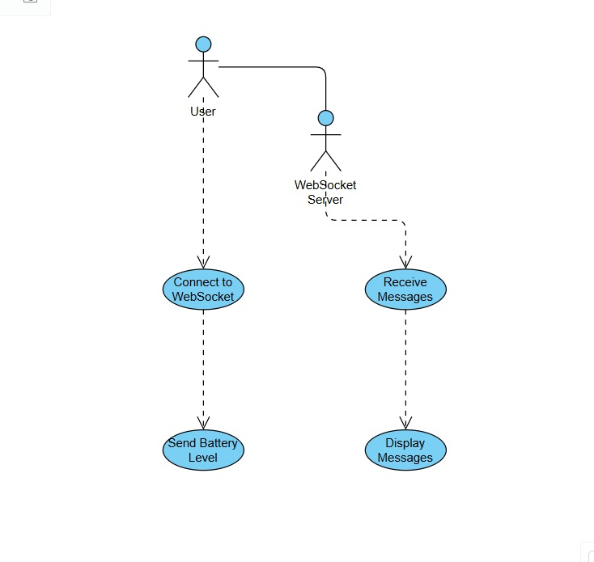
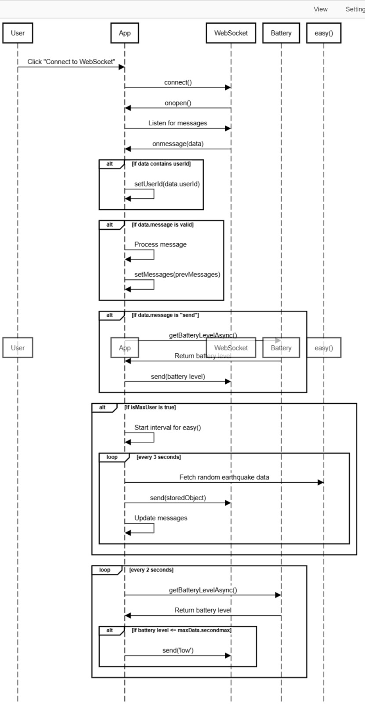
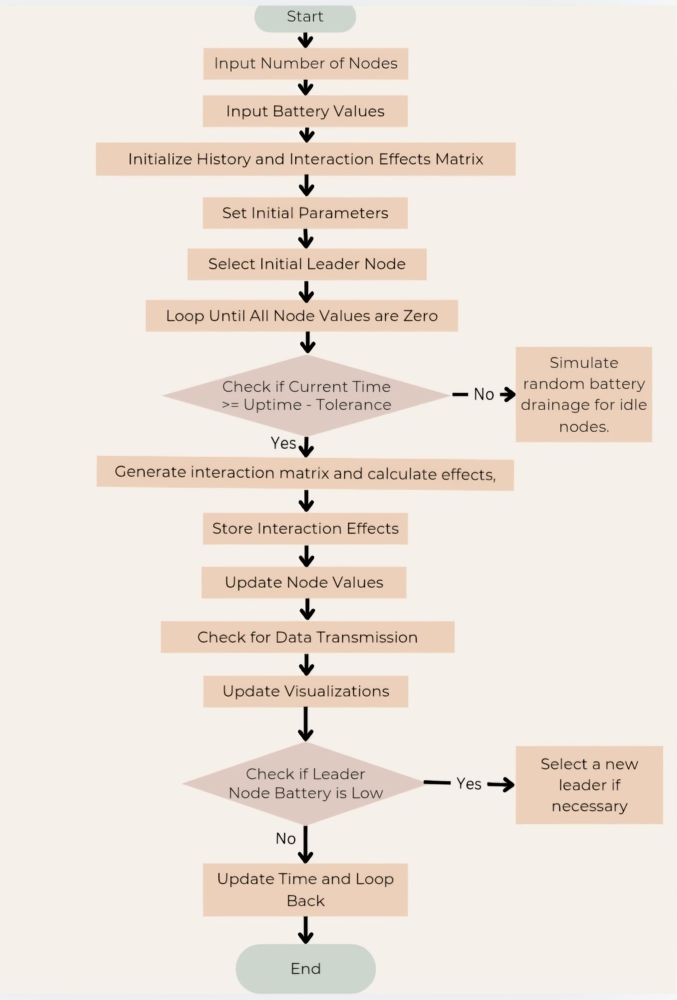
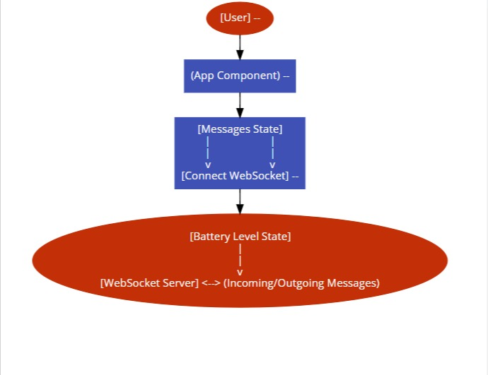
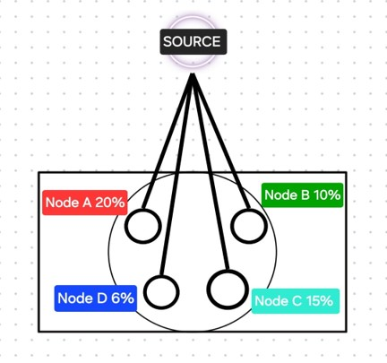
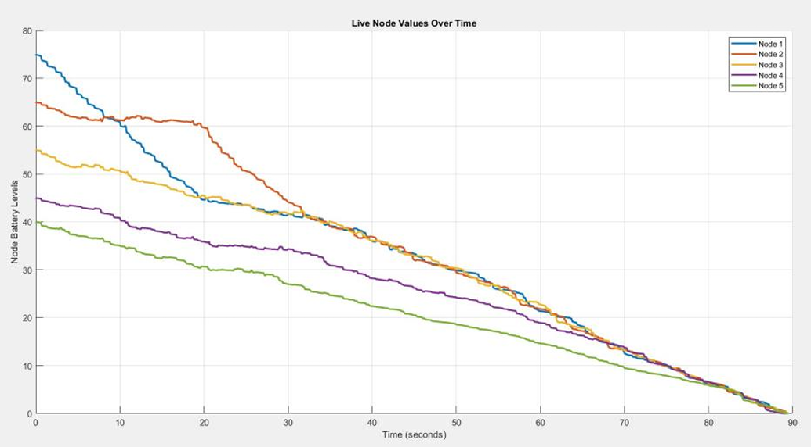
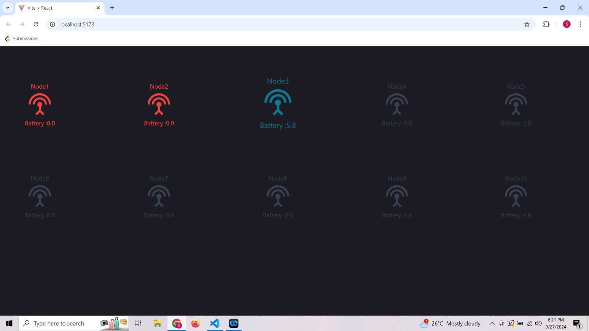
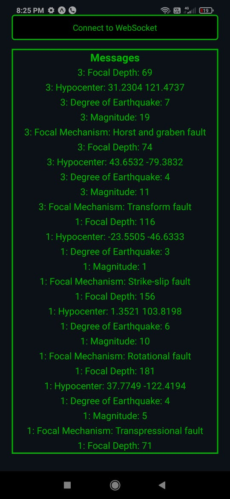

# Battery Optimization with Dynamic Leader Node Selection

This repository contains the project report, code, and resources for **"Battery Optimization with Dynamic Leader Node Selection,"** a project focused on enhancing the energy efficiency and longevity of Wireless Sensor Networks (WSNs) in disaster-prone environments.

---

## 📋 Brief Summary and Purpose

In resource-constrained environments such as disaster recovery zones, maintaining uninterrupted communication is critical. This project addresses the challenge of limited battery life in temporary wireless sensor nodes deployed during such events.  
**The core purpose:** Propose and validate an innovative, energy-efficient protocol that significantly extends the operational lifespan of deployed nodes. By optimizing energy consumption, this protocol ensures resilient and reliable communication, which is vital for effective disaster response, real-time monitoring, and efficient resource allocation.

---

## ✨ Key Features and Modules

- **Dynamic Leader Node Selection:**  
  The node with the highest battery capacity is dynamically chosen as the leader to handle data transmission. This process occurs at regular intervals to prevent rapid depletion of any single node. Non-leader nodes remain in low-power sleep mode to conserve energy.

- **Modified Wake-Up Radio Concept:**  
  Enhances energy efficiency by dynamically managing node activity cycles, allowing non-essential nodes to remain in sleep mode until needed.

- **Intelligent Cluster Head Switching:**  
  Selects cluster head nodes based on sufficient battery life, distributing energy load more evenly and supporting network longevity.

- **Multi-Platform Simulation:**  
  - **MATLAB Simulation:** In-depth analysis of energy conservation, leader rotation, and realistic network behavior, with real-time visualization.
  - **Web Application (React):** Real-time, interactive display of network activity, including node statuses, battery levels, and leader identification.
  - **Android Application:** Real-time data exchange and status updates using mobile device functionality and WebSocket communication, including automated data generation (e.g., random earthquake data).

- **WebSocket Communication:**  
  Utilized in both web and Android applications for real-time, bidirectional event-based communication, ensuring dynamic updates and interactive experiences.

---

## 🚀 Installation and Usage

> **Detailed installation and usage instructions are provided in the documentation or within each simulation platform’s codebase.**  
> Below are general guidelines:

### MATLAB Simulation
- Run the MATLAB scripts to initialize the IoT network, simulate dynamic leader node selection, and visualize network behavior.
- The simulation provides graphical representations of node statuses, battery levels, and communication efficiency.

### Web Simulation
- Navigate to the web application in a browser.
- The interface displays real-time updates on node statuses, battery levels, and the current leader node.
- Interactive elements allow users to start/stop simulations and adjust parameters.

### Android Application
- Install the Android application on a compatible device or emulator.
- The app establishes a WebSocket connection for real-time data exchange and status updates, displaying battery levels and other critical information dynamically.

---

## ⚙️ Special Requirements or Dependencies

### Software/Tools Versions
- **MATLAB:** R2022a or higher
- **Web Framework:** React v17 or higher
- **Android Development:** Android Studio v4.1 or higher, with support for Java 8 or Kotlin
- **WebSocket Library:** Socket.IO or equivalent
- **Version Control:** Git

### Hardware Requirements

| Platform            | RAM         | Processor             | Disk Space   | Notes                                  |
|---------------------|-------------|-----------------------|--------------|----------------------------------------|
| MATLAB Simulation   | 8 GB (16 GB recommended) | Intel Core i5 or equivalent | 10 GB+       |                                        |
| Web Simulation      | 8 GB        | Intel Core i5 or equivalent | --           | Stable broadband for real-time comm.   |
| Android Simulation  | 8 GB        | Intel Core i5 or equivalent | --           | Android device (2 GB RAM+, Android 6.0+) or emulator (4 GB RAM+) |

---

## 📊 Results, Screenshots, and Demos

The project's results demonstrate a significant reduction in energy consumption while maintaining robust and reliable communication in IoT networks. Simulations provide comparative insights, showcasing clear battery conservation improvements over traditional approaches.

> **Below are placeholders for images, diagrams, and screenshots — please upload images and replace the links accordingly:**

### UML Diagrams
- 
<!--
- 
-->
- 

### Protocol Workflow Diagram
- 
- 

### MATLAB Simulation Screenshots
- 
- 

### Web Application Screenshots
- 

### Android Application Screenshots
- 

<!-- 
### Comparative Results Graphs/Charts
- 
- 
-->

---

## 👨‍💻 Authors

- Revanth N Murthy  
- Sankalp B Chandavarkar  
- Swasthik Prabhu  
- Vedanth J

---

## 🙏 Acknowledgments

The success of this project is attributed to the guidance and support of:

- **Dr. Niranjan N Chiplunkar**, Principal, NMAMIT, Nitte (for moral support)
- **Dr. Radhakrishna**, Professor & Head, Dept. of Computer & Communication Engineering, NMAMIT, Nitte (for valuable suggestions and expert advice)
- **Mr. Krishna Prasad D S**, Project Coordinator, Dept. of C&CE, NMAMIT, Nitte (for exceptional leadership, dedication, and support)
- **Mr. Sandeep Kumar S**, Guide, Dept. of C&CE, NMAMIT, Nitte (for able guidance, encouragement, and assistance)
- Parents, faculty members, peers, and friends for their constant support and valuable suggestions.

---

<b>For questions or collaboration, please contact us via GitHub or LinkedIn.</b>

